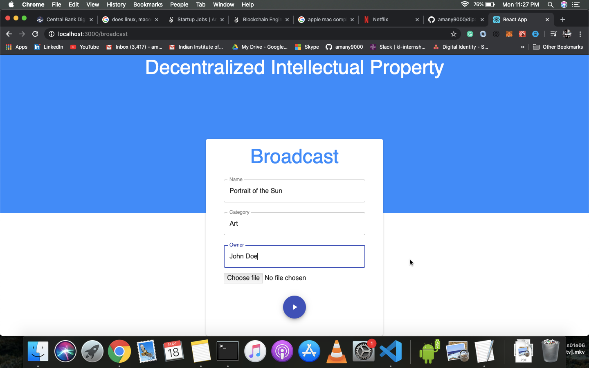

# DIP - the Decentralised Intellectual Property database



### About
A use case intended for [WIPO](https://www.wipo.int/portal/en/index.html). The end product is a global Intellectual Property (IP), maintained on a DLT and not owned by any single Country or Company.


### Development

-   Install Dependencies.

```sh
npm install
```

-   To run the App.

```sh
npm start
```
---

### Technologies Used

##### Back End

-   [Node](https://nodejs.org)
-   [BigchainDB](https://github.com/bigchaindb/bigchaindb)
-   [IPFS](https://ipfs.io/)

##### Front End

-   [React](https://reactjs.org)

---

### Contributing

See [CONTRIBUTING.md](CONTRIBUTING.md).

---

### Team Members

-   [Aman Yadav](https://github.com/amany9000)
-   [Dipansh Khandelwal](https://github.com/DipanshKhandelwal)
-   [Divyesh Puri](https://github.com/DivyeshPuri)
-   [Rohan Dhoot](https://github.com/rohan2599)

---

Found a bug? Create an [issue](https://github.com/amany9000/dip/issues).